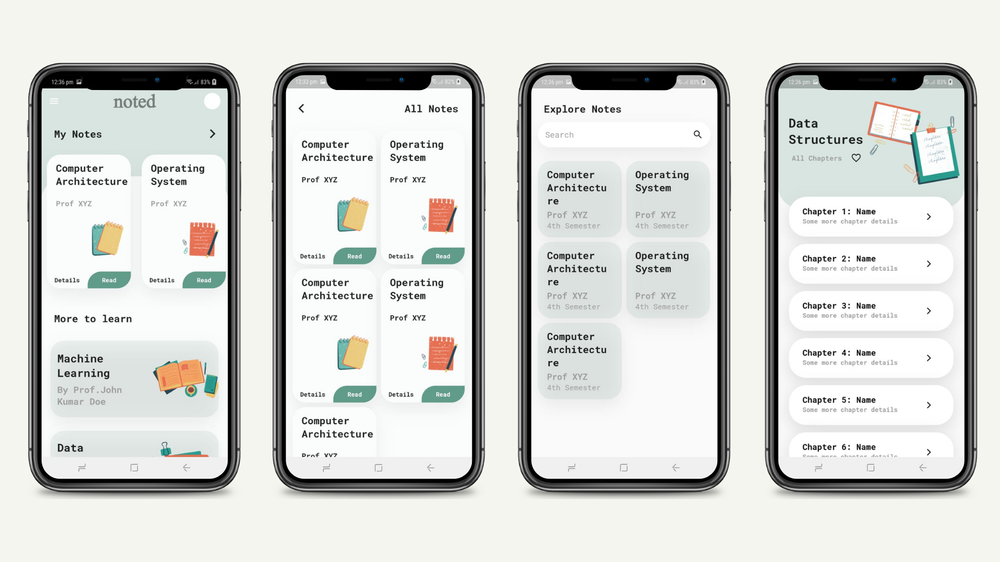

<h1 align="center">noted</h1>

<h5 align="center">
  Built and mentored with ❤︎ by
  <a href="https://github.com/ayush-670">Ayush Singh</a> and
  <a href="https://github.com/Rajwrita">
    Rajwrita Nath
  </a>
</h5>

 

 

 

 

## Idea

Find all your college syllabus notes and additional materials carefully curated but teachers in one place. Solve quizzes, discover subject topics, bookmark important notes and make studying easy.

## Getting Started

This project is a starting point for a Flutter application.

A few resources to get you started if this is your first Flutter project:

- [Lab: Write your first Flutter app](https://flutter.dev/docs/get-started/codelab)
- [Cookbook: Useful Flutter samples](https://flutter.dev/docs/cookbook)

For help getting started with Flutter, view our
[online documentation](https://flutter.dev/docs), which offers tutorials,
samples, guidance on mobile development, and a full API reference.
